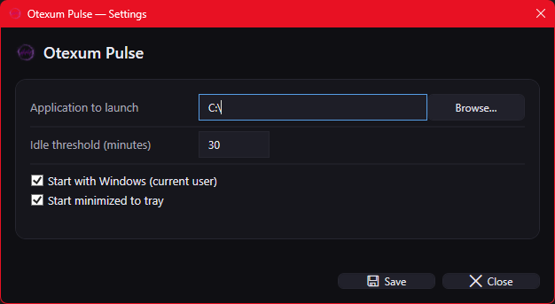

# 🟣 Otexum Pulse


---

## Overview

**Otexum Pulse** is a lightweight, modern Windows application designed to automatically launch a program after your PC has been idle for a set amount of time. Ideal for setups where you want background tools like **LM Studio** or other apps to self-start after inactivity. The app runs silently in the background once configured.

Built with **WPF (.NET 8)**, it’s visually minimal, resource-light, and fully user-configurable.

---

## ✨ Features

* ✅ Detects user inactivity and launches a chosen application after your set threshold.
* ⚙️ Adjustable idle timer (1–240 minutes) with numeric input.
* 🔁 Option to **start with Windows** for automatic background operation.
* 🧩 Persistent configuration stored in `%AppData%/OtexumPulse/config.json`.
* 🖼️ Clean modern UI with dark theme and accent color.
* 🪶 No dependencies on online services or background daemons.

---

## 🧭 Usage

1. Launch **Otexum Pulse**.
2. In the UI:

   * Browse for the application you want to auto-launch.
   * Set your idle time in minutes.
   * Optionally enable *Start with Windows* and *Start minimized*.
3. Click **Save**.
4. The app will monitor system idle time and automatically start the chosen application when the threshold is reached.

---

## ⚙️ Configuration

Otexum Pulse stores its settings in:

```
%AppData%\OtexumPulse\settings.json
```

A sample configuration:

```json
{
  "ExePath": "C:\\Program Files\\LM Studio\\LMStudio.exe",
  "IdleMinutes": 45,
  "StartWithWindows": true,
  "StartMinimized": false
}
```

---

## 🪟 Requirements

* **Windows 10 / 11** (x64)
* **.NET 8 Runtime** (bundled if using self-contained build)

---

## 📦 Building

To build locally:

```bash
git clone https://github.com/yourusername/OtexumPulse.git
cd OtexumPulse
dotnet build -c Release
```

### Publish (Portable Folder)

```bash
dotnet publish -c Release -r win-x64 --self-contained true -o Publish/
```

---

## 📜 License

This project is licensed under the **MIT License**. See the `LICENSE` file for details.

---

## 📸 Screenshots

| Settings Window                       | 
| ------------------------------------- | 
|  | 

---

## 🧠 Notes

* The app runs entirely offline and stores all configuration locally.
* Designed for developers, self-hosters, and users who need automation without cloud dependencies.
* Idle detection is based on **user input**, not CPU utilization.

---

**Otexum Pulse** — Small. Smart. Silent.
